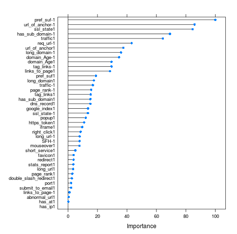

# Phishing Websites Predictions

This project uses [Phishing Websites](archive.ics.uci.edu/ml/datasets/Phishing+Websites) dataset from UCI machine learning Datasets. The objective is to identify whether a website is a Phishing website one or not.

### Codebook

There are 31 columns in the dataset, containing 30 features and 1 target. In total there are 2456 observations in the dataset.
I have used 75% of observations(1843) as the training set and remaining(613) for test set.
Here is a list of all the attributes in the dataset, along with their possible values and column names used:

<table>
    <thead>
        <tr>
            <th>Attributes
            <th>Values
            <th>Column Name
        </tr>
    </thead>
    <tr>
        <td>Having IP Address
        <td>{ 1,0 }
        <td> has_ip
    </tr>
    <tr>
        <td>Having long url 
        <td>{ 1,0,-1 }
        <td> long_url
    </tr>
    <tr>
        <td>Uses ShortningService
        <td>{ 0,1 }
        <td>short_service
    </tr>
    <tr>
        <td>Having '@' Symbol
        <td>{ 0,1 }
        <td>has_at
    </tr>
    <tr>
        <td>Double slash redirecting
        <td>{ 0,1 }
        <td>double_slash_redirect
    </tr>
    <tr>
        <td>Having Prefix Suffix  
        <td>{ -1,0,1 }
        <td>pref_suf
    </tr>
    <tr>
        <td>Having Sub Domain  
        <td>{ -1,0,1 }
        <td>has_sub_domain
    </tr>
    <tr>
        <td>SSLfinal State  
        <td>{ -1,1,0 }
        <td>ssl_state
    </tr>
    <tr>
        <td>Domain registeration       length 
        <td>{ 0,1,-1 }
        <td>long_domain
    </tr>
    <tr>
        <td>Favicon 
        <td>{ 0,1 }
        <td>favicon
    </tr>
    <tr>
        <td>Is standard Port
        <td>{ 0,1 }
        <td>port
    </tr>
    <tr>
        <td>Uses HTTPS token
        <td>{ 0,1 }
        <td>https_token
    </tr>
    <tr>
        <td>Request_URL  
        <td>{ 1,-1 }
        <td>req_url
    </tr>
    <tr>
        <td>Abnormal URL anchor 
        <td>{ -1,0,1 }
        <td>url_of_anchor
    </tr>
    <tr>
        <td>Links_in_tags 
        <td>{ 1,-1,0 }
        <td>tag_links
    </tr>
    <tr>
        <td>SFH  
        <td>{ -1,1 } 
        <td>SFH
    </tr>
    <tr>
        <td>Submitting to email 
        <td>{ 1,0 }
        <td>submit_to_email
    </tr>
    <tr>
        <td>Abnormal URL 
        <td>{ 1,0 }
        <td>abnormal_url
    </tr>
    <tr>
        <td>Redirect  
        <td>{ 0,1 }
        <td>redirect
    </tr>
    <tr>
        <td>on mouseover  
        <td>{ 0,1 }
        <td>mouseover
    </tr>
    <tr>
        <td>Right Click  
        <td>{ 0,1 }
        <td>right_click
    </tr>
     <tr>
        <td>popUp Window  
        <td>{ 0,1 }
        <td>popup
    </tr>
     <tr>
        <td>Iframe 
        <td>{ 0,1 }
        <td>iframe
    </tr>
     <tr>
        <td>Age of domain  
        <td>{ -1,0,1 }
        <td>domain_age
    </tr>
     <tr>
        <td>DNS Record   
        <td>{ 1,0 } 
        <td>dns_record
    </tr>
     <tr>
        <td>Web traffic  
        <td>{ -1,0,1 }
        <td>traffic
    </tr>
     <tr>
        <td>Page Rank
        <td> { -1,0,1 }
        <td>page_rank
    </tr>
     <tr>
        <td>Google Index 
        <td>{ 0,1 }
        <td>google_index
    </tr>
     <tr>
        <td>Links pointing to page 
        <td>{ 1,0,-1 }
        <td>links_to_page
    </tr>
    <tr>
        <td>Statistical report 
        <td>{ 1,0 }
        <td>stats_report
    </tr>
    <tr>
        <td>Result 
        <td>{ 1,-1 }
        <td>target
    </tr>
    
</table>

All the attributes having a binary value space are generally denoting the absence or presence of respective attribute. Attributes with three possible values are generally representing the strength(low, medium, high).

### R Script
Identification of the possible phishing websites is done in `R` with `caret`.

* The R script - <b>phishing.R</b> initially load the required libraries and the dataset from <b>phishing.csv</b> file
* Column names are set using `names` array(as shown in codebook above)
* Dataset is then split into training and test set useing caret's `createDataPartition` method
* Then three different models are applied on the training dataset - `boosted Logistic Regression`, `SVM with RBF Kernel`, `Tree Bag`
* For each model we get the `confusionMatrix` after predicting the samples from test set
 
### Codebase Structure
* <b>Ipython Notebooks\\</b> - contains ipython notebooks used with `BigML` and to paritition train and test set
* <b>Datasets\\</b> - contains CSV Data files used in BigML and R Script
* <b>attributes.txt </b>- contains info about the attributes in Dataset
* <b>phishing.R</b> - R Script to apply treebag model(similar to BigML-ensemble)
* <b>Conclusion.pdf</b> - Anwer for - do you think these predictions are good?
* <b>BigML_classification.py</b> - Python Script for calling and running ensemble model on BigML API
* <b>BigML_summary.txt</b> - Summary of BigML model

###  Results
I was able to get <b>96.4%</b> accuracy with the `treebag` model. Here is a plot for the variable importance in the tree bag model. 

